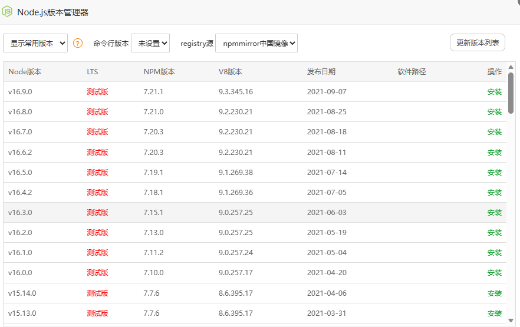
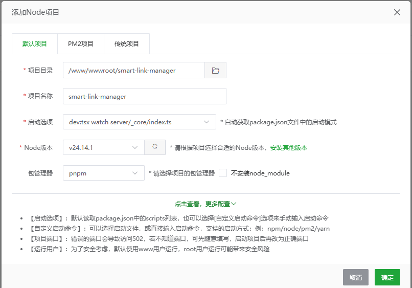
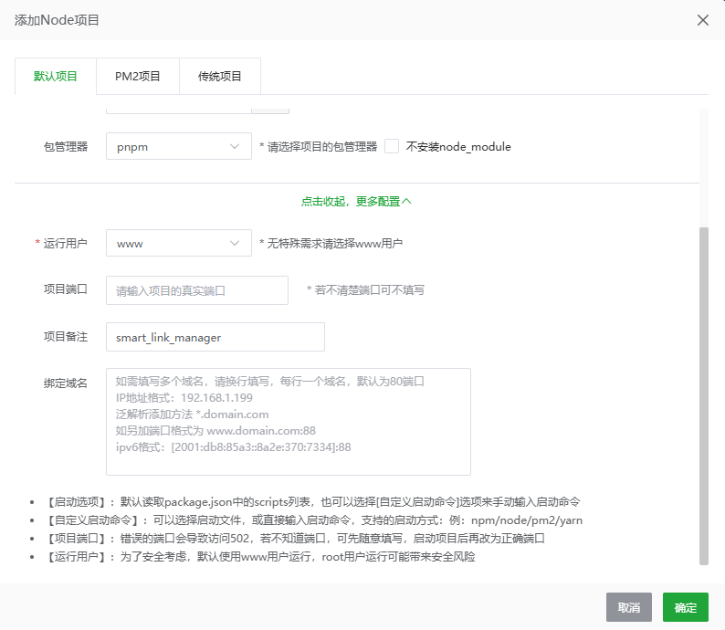

# Smart Link Manager 宝塔面板部署全指南 (腾讯云环境)

本项目推荐在腾讯云服务器上使用 **宝塔面板 (BT Panel)** 进行管理。为了确保“本地测试”与“生产运行”的一致性，**强烈建议优先使用 Docker 部署方式**。

### 0. 安装宝塔面板 (Ubuntu)
如果您还未安装宝塔面板，请通过 SSH 登录您的云服务器，并执行以下命令进行安装：
```bash
wget -O install.sh https://download.bt.cn/install/install-ubuntu_6.0.sh && sudo bash install.sh ed8484bec
```

---

## 🚀 方案一：Docker 部署 (推荐 - 开发/生产一致性之王)

Docker 将代码及其运行环境封装在镜像中，能彻底解决 Windows 开发环境到 Linux 生产环境常见的路径大小写、系统库库版本不兼容等问题。

### 1. 环境准备
1. 在宝塔面板 **“软件商店”** 搜索并安装 **“Docker”** 插件。
2. 确保面板已安装 **MySQL 5.7**。

### 2. 代码配置
1. 在 `/www/wwwroot/` 目录下创建项目文件夹（如 `smart-link-manager`）。
2. 将本地源码上传至该目录（**注意：排除 `node_modules` 和 `dist` 文件夹**）。

### 3. 环境变量设置
在项目根目录创建或编辑 `.env` 文件：
```env
DATABASE_URL=mysql://用户名:密码@127.0.0.1:3306/数据库名
# Docker 使用 host 网络模式，可直接连接宿主机 3306 端口
JWT_SECRET=（填写一个32位以上的随机字符串）
VITE_APP_ID=http://你的域名或服务器IP
NODE_ENV=production
PORT=3000
```

### 4. 容器构建与启动
在项目根目录下通过终端执行：
```bash
# 构建镜像并启动容器
docker-compose up -d --build

# 检查容器状态
docker ps

# 查看实时日志（用于排错）
docker logs -f smart-link-app
```

---

## ⚖️ 方案二：宝塔 Node 项目管理器 (轻量化方案)

如果您希望直接在宿主机运行 Node 进程，请按此步骤操作。

### 1. 基础环境
1. 在宝塔面板左侧菜单点击 **“软件商店”**。
2. 搜索 **“Node.js版本管理器”** 并点击安装。
3. 安装完成后，点击 **“设置”** -> **“更新版本列表”**。
4. 找到 **稳定版 v24.x**（或 v20.x），点击右侧的 **“安装”**。
5. **关键设置 (命令行版本)**：安装完成后，在弹窗上方的 **“命令行版本”** 下拉框中，务必选择刚才安装的 **v24.14.1**。否则终端内无法识别 node/npm 命令。
   
6. **安装 pnpm**：打开宝塔终端，执行 `npm install -g pnpm`。如果通过宝塔工具箱安装失败，请手动在终端输入此命令。

### 2. 构建项目 (关键步)
在上传并解压源码后，**必须先去服务器终端执行编译**，否则项目无法启动：
```bash
cd /www/wwwroot/项目目录
pnpm install
pnpm run build  # 这一步会生成 dist 文件夹
```

### 3. 在宝塔添加项目
1. **网站** -> **Node项目** -> **添加项目**。
2. 配置项说明：
   - **项目目录**：选择源码解压后的目录。
   - **启动选项**：选择 **“自定义启动命令”**，输入 `node dist/index.js`。
   - **项目端口**：填入 `3000`。
   
   
4. **环境变量**：填入 `.env` 中的所有键值对。

---

## 🌐 数据库架构同步 (首航关键步)

如果您的生产数据库是空的，必须同步表结构。由于 Drizzle CLI 在服务器端可能存在快照校验冲突，推荐使用**物理 SQL 初始化**方案。

**方案 A：物理 SQL 初始化 (极力推荐 - 100% 成功)**
1. 在项目根目录找到 **`init_db.sql`** 文件（如果本地没有，可联系开发人员生成）。
2. 将此文件上传至服务器项目根目录 `/www/wwwroot/项目目录`。
3. 在宝塔终端执行以下一键导入命令（替换为您自己的账号密码）：
   ```bash
   mysql -u 数据库用户名 -p数据库密码 数据库名 < init_db.sql
   ```

**方案 B：Drizzle 推送 (本地操作)**
1. 在本地开发机修改 `.env` 的 `DATABASE_URL` 指向云服务器 MySQL 的公网端口。
2. 执行 `npx drizzle-kit push`。

---

## 🔒 Nginx 反反向代理与 SSL

1. 站点设置 -> **“反向代理”** -> **“添加反向代理”**。
2. **目标 URL**：`http://127.0.0.1:3000`。
3. **发送域名**：`$host`。
4. **SSL**：开启 SSL 并申请 Let's Encrypt 证书，建议强制跳转 HTTPS。

---

## 🛠️ 生产环境 Q&A

| 遇到问题 | 解决办法 |
| :--- | :--- |
| **502 Bad Gateway** | Nginx 无法连接到 Node 进程。请检查项目管理器中的 **“日志”**。通常是因为项目没启动成功，或监听端口（默认 3000）被占用。 |
| **Unknown column 'xxxx'** | 数据库表结构与代码不一致。请按本指南的“数据库架构同步”步骤，重新运行 `init_db.sql` 覆盖旧表。 |
| **登录报错 (TRPCClientError)** | 检查数据库 `users` 表是否存在且字段完整。如果缺失 `loginMethod` 等字段，说明 SQL 初始化脚本版本过旧。 |
| **验证码/二维码生成失败** | 确认项目根目录是否有 **`uploads/`** 文件夹，且权限已设为 `www` 用户（755 权限）。 |

---

> [!TIP]
> **资源维护**：请定期备份项目根目录下的 `uploads/` 文件夹，所有的二维码、图片资产均存储在此。

---

## 📚 相关文档

- [SEO 优化实施方案](./seo-optimization-plan.md) - 搜索引擎优化详细方案
- [首页优化方案](./homepage-optimization-plan.md) - 首页转化与用户体验优化
